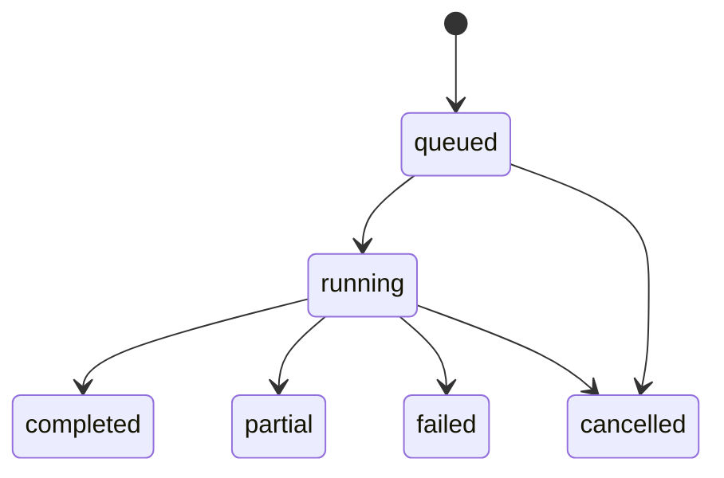

# Architecture

The current vertical slice uses a Python package with domain schemas, ingestion, analyzer ports/parsers, SQLAlchemy persistence, a worker and a FastAPI adapter. Keeping these in one package avoids empty packages and premature services. Dependencies point toward typed domain objects. The API writes durable queued scans; the explicit CLI worker commits analyzer outcomes and findings together. Repository scripts and model output execution are absent. Compiler subprocesses are permitted only inside the default-disabled source-only container adapter.

An ingested ZIP yields a sorted manifest with byte sizes and SHA-256 hashes. The source revision is the SHA-256 of canonical JSON for that manifest. It represents content, never Git history. Each upload has a fresh private snapshot directory. Hash checks run before analysis.

The safe lexical analyzer reads only data. Slither/Semgrep adapters normalize result JSON and reject source paths outside the manifest. Their Docker runner defaults to unavailable until an operator validates a rootless, confined Linux engine and a reviewed image. It builds fixed commands, stages Solidity sources only, denies network access and enforces output/time budgets. Actual container isolation remains untested. Failed tools retain an error and force `failed`; unavailable tools force `partial`. Evidence strength remains independent of human review.

Findings deduplicate exact revision/rule/path/line fingerprints within a scan. Evidence sources are retained as a list; contradictory severities are not overwritten. Different tool rule names are not assumed to describe the same vulnerability. Raw tool JSON lives in analyzer records for this bounded milestone; blob storage and retention will replace that approach before scale.

The local single-user identity is constant and protected by loopback-client, Host and Origin checks. Backend queries scope repositories, scans, findings, review and report data to that identity. Arbitrary tenant headers are ignored. This is a demo boundary, not multi-user auth. Production mode startup is rejected. PostgreSQL RLS and composite tenant foreign keys remain future requirements.

Scan lifecycle: `queued → running → completed | partial | failed | cancelled`. Partial means analysis was incomplete, not secure. Review lifecycle: `pending → accepted | rejected | needs_more_evidence`, requiring justification and an expected version. Reproduced candidate classifications are rejected because no verification evidence model exists yet.

One worker is supported. There are no distributed task leases or automatic retries. A worker crash between analyzer commits leaves `running`; rerunning skips previously committed tools. An application exception marks `failed`. A new scan provides an explicit retry. Concurrent API idempotency collisions return 409. Worker concurrency, node timeouts and durable LangGraph checkpoints are not claimed.
