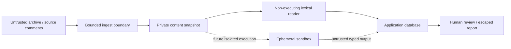

# Sentinel AI threat model

## Assets and adversaries
Assets: source snapshots and hashes, analyst decisions, scan provenance, reports, host integrity, database contents, future model credentials. Attackers: malicious archive authors, local network/browser clients, hostile tool output, malicious future model responses, compromised dependencies, and later cross-tenant users.

## Trust boundaries

## Current entry points and controls
ZIP upload is bounded to 8 MiB compressed, 16 MiB expanded, 1 MiB per file and 500 entries. Absolute paths, traversal, backslashes, drive prefixes, control characters, symlinks, special files, duplicate/case-colliding paths, encryption, unsupported file types and reserved metadata names are rejected. No extraction library writes arbitrary paths. UTF-8 decoding is required. Source-only snapshots cannot execute scripts through the current worker.

An archive is fully validated before disk writes. Files are copied into a fresh UUID directory. Snapshot hashes are checked before reading. Process umask and private parent directories must remain restrictive; storage must never be a shared attacker-controlled directory.

API identity is local-demo only, never based on request tenant headers. Host and Origin guards reduce DNS rebinding and cross-origin browser abuse. Every resource query contains a tenant predicate. Production mode is fail-closed. The demo must not be reverse-proxied.

Review decisions require justification, carry optimistic versions and create audit events. Automated scanning never edits the review column. Candidate schemas reject reproduced evidence strength because a corresponding execution evidence model does not exist yet.

Tool output is parsed as data, with source membership checks and explicit failures. Parser fixtures are synthetic. Source comments are not system instructions; there is no model invocation, shell generation or arbitrary tool interface. Lexical analysis strips comments and strings to reduce noise; this is not a prompt injection defense for a future LLM service.

Reports escape HTML and key Markdown constructs, are delivered as plain text with nosniff, and include an immutable content hash and reproduction limitations. No public artifact download endpoint exists. Generated reports should still be treated as untrusted data by downstream renderers.

## Container execution policy (implemented; runtime validation pending)
No host compiler, Slither, Semgrep build, Foundry test or repository script execution is allowed. The Docker analyzer runner stages source files only and accepts a fixed tool allowlist. It requires rootless Linux, cgroup v2, seccomp and reported resource enforcement. It is disabled by default. Validate isolation and the reviewed image before enabling it. Use digest-pinned reviewed images, a non-root user, rootless execution where available, default seccomp plus tightened policies, all capabilities dropped, no-new-privileges, no network/host namespaces, read-only root, bounded writable tmpfs, CPU/memory/PID/disk limits, execution/output limits, no credentials or Docker socket mounts, and an external watchdog that kills the container on timeout. Disable Foundry FFI and remote RPC. Never run public-chain transactions.

Docker shares a kernel; these controls alone are not a complete security boundary. Consider a VM or stronger sandbox for hostile multi-tenant builds. Verify network denial, metadata denial, mount boundaries, process/resource controls, cleanup and evidence provenance with execution tests before enabling verification.

## Residual risks and pending work
No production authentication, row-level security, composite tenant constraints, rate limiting, per-node worker watchdog, sandbox execution, artifact retention, supply-chain attestation or distributed leases exists yet. The application owner can modify snapshots and the database; hashes detect changed source bytes but cannot defend against a compromised owner. ZIP parsing and regex scanning remain untrusted-input surfaces bounded by size. Read-only snapshot files do not prevent an authorized owner from changing permissions. Upload failure can leave an orphan snapshot; retention cleanup is pending. Database-backed raw outputs must be size-limited by future executors.

No security audit or proof of resistance is implied by passing unit tests. Current local mode must not process sensitive private repositories or run on an exposed service.
